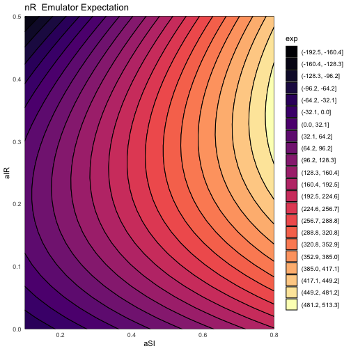

```r
#### Loading Package ####
## Installation from CRAN
# install.packages('hmer')
## For newest version, install from github
# require(devtools)
# devtools::install_github("andy-iskauskas/hmer")

### Load in the required and suggested packages
# deSolve is only required to run ode_results
library(hmer)
```

```
## Registered S3 method overwritten by 'GGally':
##   method from   
##   +.gg   ggplot2
```

```r
library(lhs)
library(deSolve)
library(ggplot2)
set.seed(12)

################# HELPER FUNCTIONS ###################

# Simple code for generating the output of the SIR deterministic model
ode_results <- function(parms, end_time = 25) {
  des = function(time, state, parms) {
    with(as.list(c(state, parms)), {
      dS <- aSR*R-aSI*I*S/(S+I+R)
      dI <- aSI*I*S/(S+I+R)-aIR*I
      dR <- aIR*I-aSR*R
      return(list(c(dS, dI, dR)))
    })
  }
  yini = c(S = 950, I = 50, R = 0)
  times = seq(0, end_time, by = 1)
  out = ode(yini, times, des, parms)
  return(out)
}

# Collates the results to give the outputs for emulation
get_res <- function(inputs) {
  ode_out <- data.frame(t(apply(inputs, 1, function(x) ode_results(x)[11, c('S', 'I', 'R')])))
  return(cbind(inputs, ode_out) |> setNames(c(names(inputs), c('nS', 'nI', 'nR'))))
}

# Very simple wrapper for lhs::randomLHS that scales the inputs to our ranges
get_lhs_design <- function(npoints, ranges) {
  initial_design <- lhs::optimumLHS(npoints, length(ranges))
  return(setNames(data.frame(t(apply(initial_design, 1, function(x) x*purrr::map_dbl(ranges, diff)+purrr::map_dbl(ranges, ~.[[1]])))), names(ranges)))
}

## Usage of the above functions ##
# initial_points <- get_lhs_design(90, ranges)
# initial_results <- get_res(initial_points)

########### EMULATION SET UP ##############

# Define the training and validation runs
training1 <- SIRSample$training
valid1 <- SIRSample$validation
# Set up the ranges
ranges <- list(aSI = c(0.1, 0.8), aIR = c(0, 0.5), aSR = c(0, 0.05))
targets <- SIREmulators$targets
# Just a little plot function
plot(do.call('rbind.data.frame', SIRSample)[,names(ranges)], pch = c(rep(16, nrow(SIRSample$training)), rep(4, nrow(SIRSample$validation))))
```


```r
# Train the emulators using the emulator_from_data defaults
ems_wave1 <- emulator_from_data(SIRSample$training, names(targets), ranges)
```

```
## Fitting regression surfaces...
## Building correlation structures...
## Creating emulators...
## Performing Bayes linear adjustment...
```

```r
# Examine the emulator structure
ems_wave1$nI
```

```
## Parameters and ranges:  aSI: c(0.1, 0.8): aIR: c(0, 0.5): aSR: c(0, 0.05) 
## Specifications: 
## 	 Basis functions:  (Intercept); aSI; aIR; I(aIR^2); aSI:aIR 
## 	 Active variables aSI; aIR 
## 	 Regression Surface Expectation:  149.8096; 199.5466; -281.9466; 201.6298; -196.1621 
## 	 Regression surface Variance (eigenvalues):  0; 0; 0; 0; 0 
## Correlation Structure: 
## Bayes-adjusted emulator - prior specifications listed. 
## 	 Variance (Representative):  3226.426 
## 	 Expectation:  0 
## 	 Correlation type: exp_sq 
## 	 Hyperparameters:  theta: 0.9033 
## 	 Nugget term: 0.05 
## Mixed covariance:  0 0 0 0 0
```

```r
# Demonstrating the behaviour of emulators at training points
ems_wave1$nS$get_exp(SIRSample$training[c(7, 19), ])
```

```
##        [,1]
## 7  701.7057
## 19 759.9477
```

```r
SIRSample$training[c(7, 19), 'nS']
```

```
## [1] 701.7057 759.9477
```

```r
ems_wave1$nS$get_cov(SIRSample$training[c(7, 19), ])
```

```
##  7 19 
##  0  0
```

```r
# Diagnostics on the emulators
validation_diagnostics(ems_wave1, targets, SIRSample$validation)
```


```
## [1] aSI aIR aSR
## <0 rows> (or 0-length row.names)
```

```r
############### PLOTTING ###############

# Plot of emulator expectations
emulator_plot(ems_wave1)
```


```r
# Demonstration of the difference between an untrained and trained emulator
plot(ems_wave1$nR)
```


```r
plot(ems_wave1$nR$o_em)
```



```r
# nth implausibility plot
emulator_plot(ems_wave1$nS, plot_type = 'imp', targets = targets, ppd = 40)
```


```r
emulator_plot(ems_wave1, plot_type = "nimp", targets = targets, ppd = 40, cb = TRUE)
```


```r
# Plot lattice: minimum implausibility and optical depth
plot_lattice(ems_wave1, targets, ppd = 35)
```

```
## `geom_smooth()` using method = 'loess' and formula 'y ~ x'
```

```
## Warning: Removed 28 rows containing missing values (geom_smooth).
```

```
## `geom_smooth()` using method = 'loess' and formula 'y ~ x'
```

```
## Warning: Removed 25 rows containing missing values (geom_smooth).
```

```
## `geom_smooth()` using method = 'loess' and formula 'y ~ x'
```


```r
# Diagnostic for 'optimal' cutoff
space_removed(ems_wave1, targets, ppd = 20) +
  geom_vline(xintercept = 3, lty = 2)
```


```r
# Same idea, but w.r.t. emulator variance
# space_removed(ems_wave1, targets, ppd = 20, modified = 'var', u_mod = seq(0.5, 1.5, by = 0.1))

############# PROPOSING POINTS ####################
# Simple generate_new_runs call
proposal1 <- generate_new_runs(ems_wave1, 500, targets)
```

```
## Proposing from LHS...
## 102 initial valid points generated for I=3
## Performing line sampling...
## Line sampling generated 40 more points.
## Performing importance sampling...
## Importance sampling generated 474 more points.
## Resample 1 
## Performing line sampling...
## Line sampling generated 40 more points.
## Performing importance sampling...
## Importance sampling generated 385 more points.
## Selecting final points using maximin criterion...
```

```r
# Plotting the proposal
plot_wrap(proposal1, ranges)
```


```r
############# MULTIWAVE PLOTTING ################

# Plot the outputs across waves
wave_values(SIRMultiWaveData, targets, l_wid = 0.8)
```


```r
# Examining the emulator uncertainties
sapply(SIRMultiWaveEmulators[[3]], function(x) x$u_sigma)
```

```
##        nS        nI        nR 
## 1.4776221 2.1416256 0.5041151
```

```r
# Simulator plot: checking that we can hit all targets with some model runs
simulator_plot(SIRMultiWaveData, targets, barcol = 'black')
```


```r
sessionInfo()
```

```
## R version 4.2.0 (2022-04-22)
## Platform: aarch64-apple-darwin20 (64-bit)
## Running under: macOS Monterey 12.5.1
## 
## Matrix products: default
## LAPACK: /Library/Frameworks/R.framework/Versions/4.2-arm64/Resources/lib/libRlapack.dylib
## 
## locale:
## [1] en_GB.UTF-8/en_GB.UTF-8/en_GB.UTF-8/C/en_GB.UTF-8/en_GB.UTF-8
## 
## attached base packages:
## [1] stats     graphics  grDevices utils     datasets  methods   base     
## 
## other attached packages:
## [1] ggplot2_3.3.6 deSolve_1.33  lhs_1.1.5     hmer_1.0.1   
## 
## loaded via a namespace (and not attached):
##  [1] mclust_5.4.9       Rcpp_1.0.8.3       mvtnorm_1.1-3     
##  [4] lattice_0.20-45    tidyr_1.2.0        assertthat_0.2.1  
##  [7] digest_0.6.29      utf8_1.2.2         mime_0.12         
## [10] R6_2.5.1           plyr_1.8.7         AlgDesign_1.2.0   
## [13] labelled_2.9.1     evaluate_0.15      highr_0.9         
## [16] pillar_1.7.0       rlang_1.0.2        rstudioapi_0.13   
## [19] miniUI_0.1.1.1     Matrix_1.4-1       combinat_0.0-8    
## [22] agricolae_1.3-5    rmarkdown_2.14     splines_4.2.0     
## [25] labeling_0.4.2     stringr_1.4.0      questionr_0.7.7   
## [28] munsell_0.5.0      shiny_1.7.1        compiler_4.2.0    
## [31] httpuv_1.6.5       xfun_0.31          pkgconfig_2.0.3   
## [34] mgcv_1.8-40        htmltools_0.5.2    tidyselect_1.1.2  
## [37] gridExtra_2.3      tibble_3.1.7       viridisLite_0.4.0 
## [40] reshape_0.8.9      fansi_1.0.3        withr_2.5.0       
## [43] crayon_1.5.1       dplyr_1.0.9        later_1.3.0       
## [46] MASS_7.3-57        grid_4.2.0         nlme_3.1-157      
## [49] xtable_1.8-4       GGally_2.1.2       gtable_0.3.0      
## [52] lifecycle_1.0.1    DBI_1.1.2          magrittr_2.0.3    
## [55] scales_1.2.0       cli_3.3.0          stringi_1.7.6     
## [58] farver_2.1.0       viridis_0.6.2      promises_1.2.0.1  
## [61] ellipsis_0.3.2     generics_0.1.2     vctrs_0.4.1       
## [64] klaR_1.7-0         RColorBrewer_1.1-3 tools_4.2.0       
## [67] forcats_0.5.1      glue_1.6.2         purrr_0.3.4       
## [70] hms_1.1.1          fastmap_1.1.0      yaml_2.3.5        
## [73] colorspace_2.0-3   cluster_2.1.3      isoband_0.2.5     
## [76] knitr_1.39         haven_2.5.0
```

